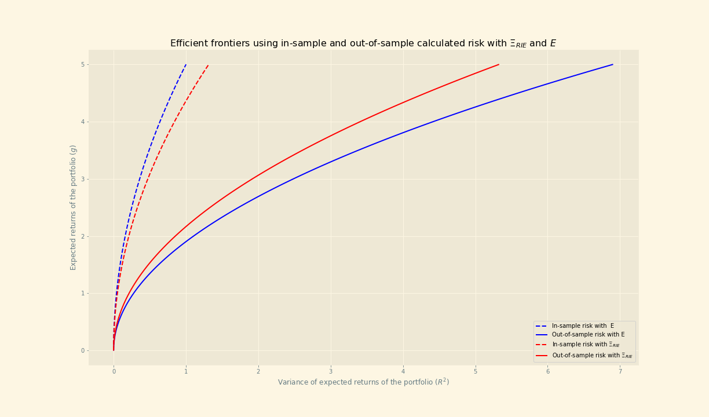

<p align="center" style="font-size:45px">
rie_estimator</p>

With this package, you can clean correlation matrices of data sets in the context of high dimensionality using the **RIE Estimator**  (Rotationally Invariant Estimator, a.k.a oracle estimator) developed by Bouchaud and Knowles in 2016 that can be found [here.](https://www.researchgate.net/publication/323255675_An_Optimal_Rotational_Invariant_Estimator_for_General_Covariance_Matrices_the_outliers)

Broadly speaking, the estimator is defined as:

<p align = "center">

</p>


The algorithm to standardize the data matrix and to calculate this estimator is followed exactly as proposed by this authors, and this implementation try to use vectorized operations when possible to improve the speed of the calculations.

In general, this estimator is used mainly in finance to obtain the correlation between assets, and it has been shown that this estimator is more precise when working with matrices in which N is approximate of the same order than T (that is, that the number of columns is of the same order that the number of rows) compared to the sample correlation matrix estimator, which is defined as below (X is the data matrix):

<p align = "center">

</p>


The package takes as the input a **pandas dataframe** with no empty values and containing only numeric features and returns a **numpy matrix** with the cleansed correlation matrix (i.e. the RIE estimator).


## Installation

You can install the package with `pip`:

```sh
pip install rie_estimator
```

*Dependencies.*

There are only two dependencies so far: *pandas* and *numpy*.


## Example of use

The input has to be a pandas dataframe containing the raw data with N columns and T rows (in Finance, this would be a matrix containing T returns of N assets), for example:


|  |BTC-USD |GC=F |GOOGL | ^MXX|
| ---| ---| ---| ---| ---|
|2021-01-05| 0.063197  |0.004114 | 0.004784  |0.004589|
|2021-01-06 | 0.083311 |-0.023455 |-0.002018 | 0.015121|
|2021-01-07 | 0.069157 | 0.002832 |-0.012382 | 0.013195|
|2021-01-08 | 0.036234 |-0.040893 | 0.017518 | 0.011705|

We can calculate the cleansed correlation matrix between this 4 assets as follows:


```python
# importing the library
import rie_estimator

# load your data matrix
data = pd.read_csv('./my dataframe')

#Calculate the RIE estimator
# If you don't want your data matrix to be standardize,
# then set normalize = False
cleansed_rie = rie_estimator.get_rie(data, normalize = True)

#Take a look at your cleansed RIE!
print(cleansed_rie)

#Output
[[ 1.10561502 -0.0221884   0.00143368  0.07711   ]
 [-0.0221884   1.10813374 -0.07954577 -0.00211591]
 [ 0.00143368 -0.07954577  1.10425599 -0.01714854]
 [ 0.07711    -0.00211591 -0.01714854  1.10154842]]


```

## Results

Just to show the advantages of using the RIE estimator against the sample correlation matrix, below it is shown the difference between the in-sample risk and out-of-sample risk of the optimal frontier when using the RIE with the Markowitz portfolio theory with assets from the S&P500. It is known that the true risk of the portfolio lies between the calculated in-sample and out-of-sample risk, and therefore a smaller gap between these two indicates a more precise estimation of the true risk, which is the result of using a more precise estimator.

 It can be seen that the gap between both risks is reduced when using the RIE estimator, in contrast to the sammple covariance matrix.

<p align="center" width="100%">
  
</p>


## To-do

I hope to be able to eventually implement a couple of things:
- Alternative forms of standardizing the data matrix, as suggested by Bouchaud and Potters.
- Accepting other objects as inputs (such as numpy matrices).
- Implementing new research related to enhancing the precission of this estimator.
